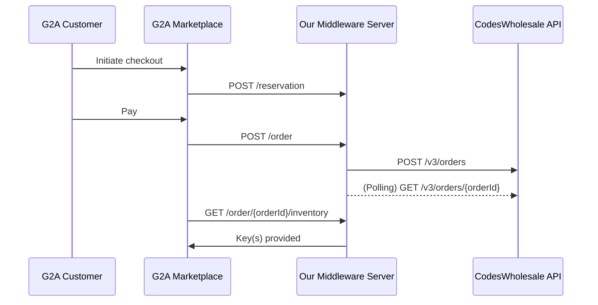

# End-to-End Order Completion Flow: G2A Dropshipping Integration

This document details the automated process for handling customer orders on G2A, from initial reservation to final key delivery. Our middleware acts as the bridge, ensuring seamless communication and fulfillment between G2A and CodesWholesale (CWS).

---

## 1. Overview of the Fulfillment Pipeline

The order fulfillment process operates as a series of interactions, primarily initiated by G2A calling endpoints hosted on our server. Our system then manages the purchase and retrieval of keys from CodesWholesale, finally delivering them back to G2A upon request.

**Key Principle:**  
We operate a just-in-time dropshipping model. Keys are purchased from CodesWholesale only after a customer has completed payment on G2A.

### General Flow



---

## 2. Detailed Fulfillment Phases & Our System's Role

Our system's core fulfillment logic resides in `src/app.js` (for inbound G2A calls) and `src/order-fulfillment/fullfillment.js` (for outbound CWS interactions and polling). All order and reservation states are persisted in the `orders.db` SQLite database.

---

### Phase 1: G2A Initiates Reservation (`POST /reservation`)

**Trigger:**  
A customer initiates the checkout process for one of our client's G2A listings. G2A needs to confirm stock availability before processing payment.

**G2A Action:**  
Makes a POST request to our server's `/reservation` endpoint.

**Request Body Example:**
```json
[
  {
    "product_id": "1000033297006",
    "quantity": 1,
    "additional_data": {}
  }
]
```

**Our System:**
- **Authentication:** Verifies G2A's credentials.
- **Product Mapping:** Looks up internal mapping to find the corresponding `cwsProductId`.
- **Real-time Stock Check:** Calls `cwsApiClient.getProduct(cwsProductId)` to check live stock on CWS.
- **Reservation Creation:**  
  - If stock is sufficient, generates a unique `reservation_id` (UUID).
  - Calculates `expiresAt` (30 minutes from now).
  - Persists reservation in the `reservations` and `reservation_items` tables.
- **Response:**  
  - `200 OK` with `reservation_id` and confirmed stock.
  - `409 Conflict` if stock is insufficient.
  - `404 Not Found` if mapping is missing.

---

### Phase 2: G2A Confirms Order & We Place CWS Order (`POST /order`)

**Trigger:**  
Customer successfully pays on G2A.

**G2A Action:**  
Makes a POST request to `/order`.

**Request Body Example:**
```json
{
  "reservation_id": "2a121cfe-8e7e-4ec2-a189-1738a43cc5e6",
  "g2a_order_id": 80201000000192
}
```

**Our System:**
- **Authentication & Validation:** Verifies credentials, checks reservation validity.
- **Mapping & Price Check:** Retrieves product mapping and live price from CWS.
- **Order Placement:**  
  - Places a single CWS order for all products/quantities.
  - Stores order and items in the `orders` and `order_items` tables.
- **Reservation Cleanup:** Deletes the used reservation.
- **Response:**  
  - `202 Accepted` if fulfillment is pending.
  - `200 OK` if codes are instantly available.
  - `410 Gone` if reservation is invalid/expired.

---

### Phase 3: CodesWholesale Order Placement & Polling (Background Worker)

**Trigger:**  
Initiated asynchronously after order placement.

**Our System:**
- **DB Record:** Inserts/updates order and items in the DB.
- **CWS Order Placement:** Calls `cwsApiClient.placeOrder`.

**Request Body Example (to CWS):**
```json
{
  "allowPreOrder": true,
  "orderId": "3232jiidf",
  "products": [
    {
      "price": 5.3,
      "productId": "466c805b-ead1-4851-bc4f-9eda242550ad",
      "quantity": 2
    },
    {
      "price": 2.81,
      "productId": "067ccfe1-655a-4a1f-8362-c655bb9bbf95",
      "quantity": 1
    }
  ]
}
```

**CWS Response Example (Order Placed, Fulfilling):**
```json
{
  "orderId": "5afd584c-c0d0-4628-8b8b-e44561f6f1b5",
  "clientOrderId": "3232jiidf",
  "identifier": "TOGENERATE-99962",
  "totalPrice": 13.41,
  "createdOn": "2025-07-14T18:05:36.659Z",
  "status": "Fulfilling",
  "products": [
    {
      "productId": "466c805b-ead1-4851-bc4f-9eda242550ad",
      "name": "1-2-Switch",
      "unitPrice": 5.30,
      "codes": [],
      "links": []
    },
    {
      "productId": "067ccfe1-655a-4a1f-8362-c655bb9bbf95",
      "name": "Ace Combat 7: Skies Unknown",
      "unitPrice": 2.81,
      "codes": [],
      "links": []
    }
  ],
  "links": [
    {
      "rel": "self",
      "href": "https://sandbox.codeswholesale.com/v3/orders/3232jiidf"
    }
  ]
}
```

**Polling for Completion (GET /v3/orders/{orderId}):**
- The system polls this endpoint until `status` is `"Completed"` and codes are present.

**CWS Response Example (Order Completed, Codes Available):**
```json
{
  "orderId": "3510f3be-9736-4705-b4d6-cb1cb3420124",
  "clientOrderId": "string",
  "identifier": "TOGENERATE-99958",
  "totalPrice": 5.02,
  "createdOn": "2025-07-14T17:27:43.000Z",
  "status": "Completed",
  "products": [
    {
      "productId": "14e7693f-888e-470f-94f4-f102aa314d22",
      "name": "Cities: Skylines",
      "unitPrice": 5.02,
      "codes": [
        {
          "codeType": "CODE_TEXT",
          "status": "Text code",
          "codeId": "c64e2480-850e-4366-bda2-27e708d77528",
          "filename": "",
          "code": "51B506CD-E164-40C4-9F8F-2E45A3D42F50",
          "links": [
            {
              "rel": "self",
              "href": "https://sandbox.codeswholesale.com/v3/codes/c64e2480-850e-4366-bda2-27e708d77528"
            }
          ]
        }
      ],
      "links": []
    }
  ],
  "links": [
    {
      "rel": "self",
      "href": "https://sandbox.codeswholesale.com/v3/orders/string"
    }
  ]
}
```

**Polling Logic:**
- If `status` is `"Completed"` and all `products[].codes` arrays are populated, the order is marked as fulfilled and codes are stored in the DB.
- If `status` is `"Fulfilling"` or codes are missing, polling continues.
- If `status` is `"Cancelled"` or `"Failed"`, the order is marked as failed.

---

### Phase 4: G2A Retrieves Key(s) (`GET /order/:orderId/inventory`)

**Trigger:**  
G2A requests the purchased key(s) for delivery.

**G2A Action:**  
Makes a GET request to `/order/{orderId}/inventory`.

**Our System:**
- **Authentication & Lookup:** Verifies credentials, fetches order and items.
- **Key Delivery Logic:**  
  - If `status === 'COMPLETED'`, returns all codes in the required G2A format (supports text, account, file types).
  - If `status === 'POLLING_CWS'`, returns an empty inventory array (not ready yet).
  - If `status === 'FAILED'`, returns `500` with error message.
  - If order not found, returns `404`.

**Response Example (for 2 keys):**
```json
[
  {
    "product_id": 10000033297006,
    "inventory_size": 1,
    "inventory": [
      { "id": "uuid-for-key1", "kind": "text", "value": "KEY-ABC-111" }
    ]
  },
  {
    "product_id": 10000033297006,
    "inventory_size": 1,
    "inventory": [
      { "id": "uuid-for-key2", "kind": "text", "value": "KEY-DEF-222" }
    ]
  }
]
```

---

## 3. Database State Changes

- **reservations**: Gains a new entry on reservation, deleted on order placement.
- **orders**: Gains a new entry on order placement, status updated by polling.
- **order_items**: Stores all product/quantity/code info for each order.

---

## 4. Error Handling

- **Reservation errors:** 404 (mapping), 409 (stock), 410 (expired).
- **Order errors:** 410 (expired reservation), 500 (CWS failure).
- **Polling errors:** Order marked as `FAILED` if CWS fails/cancels.
- **Inventory errors:** 404 (order not found), 500 (fulfillment failed).

---

## 5. Recovery & Robustness

- On server startup, the polling worker resumes any pending fulfillments.
- All DB operations for order placement are wrapped in a transaction for atomicity.
- The system is robust to server restarts and partial failures.

---

## 6. References

- **G2A API Documentation:** See `/docs/g2a-merchent`
- **CodesWholesale API Documentation:** See `/docs/cws`
- **Source Code:**  
  - Main logic: `src/app.js`
  - Fulfillment worker: `src/order-fulfillment/fullfillment.js`

---

## 7. Troubleshooting

- **Schema errors:** Ensure both `src/app.js` and `src/order-fulfillment/fullfillment.js` define the same DB schema.
- **Missing codes:** Check CWS order status and polling logs.
- **API errors:** Review logs for error messages and stack traces.

---

**This flow ensures that every step of the order fulfillment process is handled automatically and robustly, from the moment G2A requests a reservation to the final delivery of the digital key(s).**
